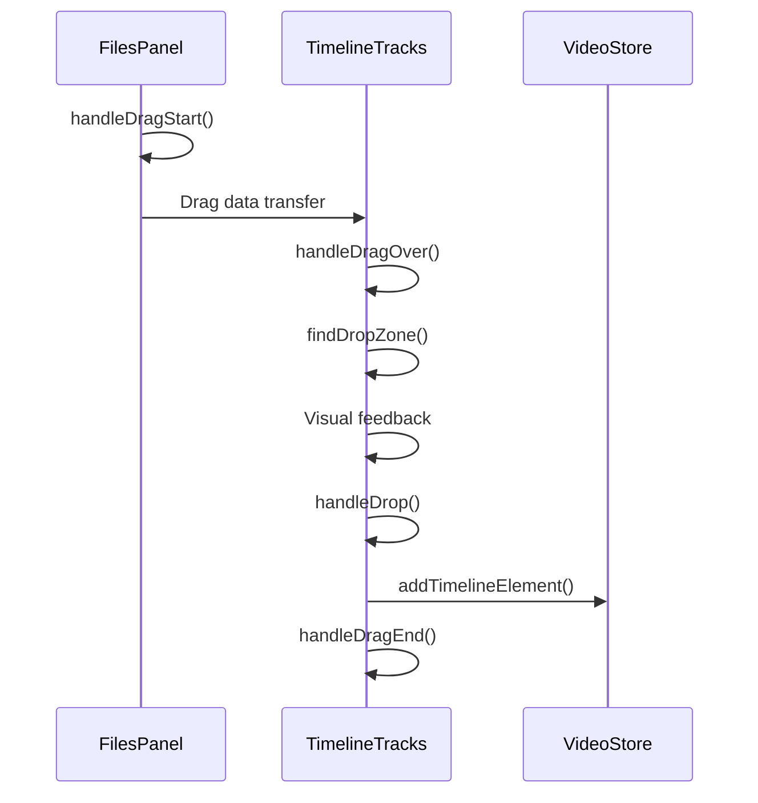
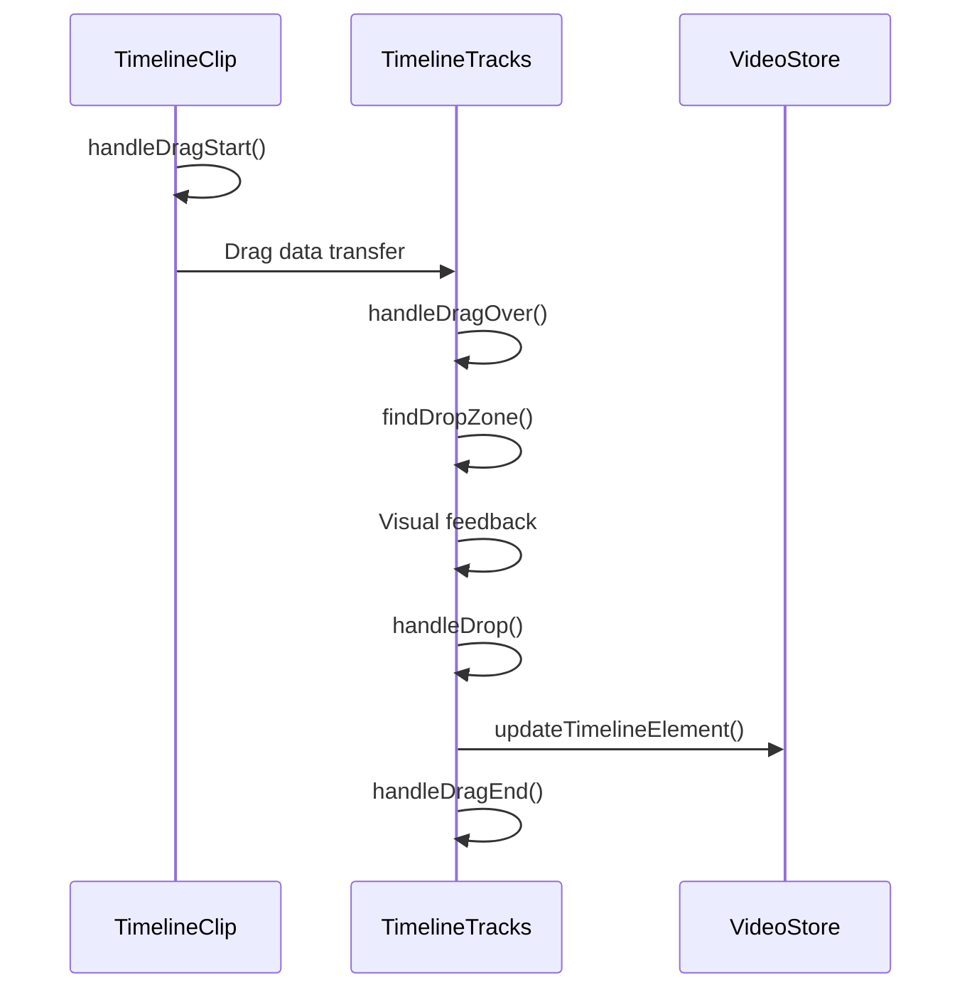

# Dreamreel Video Editor - Drag and Drop System Documentation

## Overview

The Dreamreel video editor implements a comprehensive drag and drop system that allows users to:
- Drag media files from the Files Panel to Timeline Tracks
- Reposition existing timeline elements between tracks
- Get visual feedback during drag operations
- Auto-scroll the timeline during drag operations

## Architecture

### Core Components

#### 1. **FilesPanel.tsx**
- **Purpose**: Handles drag initiation for media files
- **Key Functions**:
  - `handleDragStart()`: Sets up drag data and visual feedback
  - `handleDragEnd()`: Cleanup after drag operation
- **Drag Data Format**:
  ```typescript
  {
    mediaFileId: string,
    mediaType: 'video' | 'audio' | 'image',
    source: 'filesPanel'
  }
  ```

#### 2. **TimelineTracks.tsx**
- **Purpose**: Main drag and drop handler for timeline
- **Key Functions**:
  - `handleDragOver()`: Validates drop zones and provides visual feedback
  - `handleDrop()`: Processes the drop operation
  - `findDropZone()`: Determines valid drop locations
- **Supports**: Both new media files and existing timeline elements

#### 3. **TimelineClip.tsx**
- **Purpose**: Handles drag operations for existing timeline elements
- **Key Functions**:
  - `handleDragStart()`: Initiates drag for existing elements
- **Drag Data Format**:
  ```typescript
  {
    timelineElementId: string,
    elementType: 'video' | 'audio' | 'image' | 'text'
  }
  ```

#### 4. **DragPreview.tsx**
- **Purpose**: Provides visual feedback during drag operations
- **Features**:
  - Shows item name and duration
  - Indicates valid/invalid drop zones with color coding
  - Differentiates between new and existing element drags

#### 5. **TimelineDropIndicator.tsx**
- **Purpose**: Shows where items will be placed on drop
- **Features**:
  - Position indicator line
  - Preview of item placement
  - Contextual messages for drop actions

### Supporting Files

#### 6. **timeline.types.ts**
- **Purpose**: TypeScript definitions for drag and drop system
- **Key Types**:
  - `DropZone`: Defines valid drop locations
  - `DragPreviewProps`: Props for drag preview component
  - `TimelineDropIndicatorProps`: Props for drop indicator

#### 7. **timelineUtils.ts**
- **Purpose**: Utility functions for drag and drop logic
- **Key Functions**:
  - `isMediaTypeCompatibleWithTrack()`: Validates track compatibility
  - `getClipColor()`: Returns appropriate colors for media types
  - `getClipIcon()`: Returns appropriate icons for media types

#### 8. **use-timeline-auto-scroll.ts**
- **Purpose**: Provides smooth auto-scrolling during drag operations
- **Features**:
  - Edge detection for scroll triggers
  - Smooth animation frames
  - Configurable scroll speed and thresholds

## Drag and Drop Flow

### 1. **New Media File Drag (Files Panel → Timeline)**



### 2. **Existing Element Drag (Timeline → Timeline)**



## Track Compatibility Rules

| Track Number | Track Type | Compatible Media Types |
|--------------|------------|----------------------|
| 0 | Video | video |
| 1 | Audio | audio |
| 2 | Text | text |
| 3 | Image | image |
| 4+ | Custom | All types |

## Drop Zone Validation

### Valid Drop Conditions:
1. **Track Compatibility**: Media type matches track requirements
2. **Smart Positioning**: Automatic collision avoidance with edge insertion
3. **Valid Position**: Drop position is within timeline bounds

### Drop Zone Types:
- **Exact**: Place at specific timeline position (no collision)
- **Before**: Insert before existing element (18px edge detection)
- **After**: Insert after existing element (18px edge detection)

## Edge Insertion System

### Edge Detection Logic:
- **Threshold**: 18 pixels from element start/end edges
- **Priority**: Edge insertion takes precedence over exact positioning
- **Visual Feedback**: Blue pulsing indicators for edge insertion modes
- **Auto-Repositioning**: Automatically shifts affected elements to prevent overlap

### Insertion Behavior:
1. **Before Insertion**:
   - Places new element at target element's start time
   - Shifts target element and all subsequent elements right by new element's duration
   - Visual indicator: Left-pointing blue arrow

2. **After Insertion**:
   - Places new element immediately after target element
   - Shifts all subsequent elements right by new element's duration
   - Visual indicator: Right-pointing blue arrow

3. **Exact Placement**:
   - Only when not within edge threshold
   - Requires empty space with no collisions
   - Visual indicator: Green positioning line

## Visual Feedback System

### Drag Preview
- **Green Border**: Valid exact drop location
- **Red Border**: Invalid drop location
- **Blue Ring**: Existing element being dragged
- **Item Info**: Shows name and duration

### Drop Indicators
- **Green Line**: Exact drop position
- **Green Preview**: Shows final element placement for exact drops
- **Blue Preview**: Shows edge insertion placement (pulsing animation)
- **Blue Arrows**: Direction indicators for before/after insertion
- **Track Overlay**: Indicates valid/invalid track
- **Contextual Messages**: Explains drop action with timestamps

### Track States
- **Default**: `bg-muted/20`
- **Valid Drop**: `bg-green-500/10 border-green-500/30`
- **Invalid Drop**: `bg-red-500/10 border-red-500/30`
- **Hover**: `hover:bg-muted/30`

### Animation System
- **Timeline Elements**: 300ms ease-out transitions for repositioning
- **Drop Indicators**: Pulsing animation for edge insertion modes
- **Disabled During Drag**: No animations while actively dragging/resizing

## Auto-Scroll System

### Configuration
```typescript
{
  scrollSpeed: 3,           // Base scroll speed
  edgeThreshold: 60,        // Pixels from edge to trigger scroll
  isActive: isDragging      // Only active during drag
}
```

### Behavior
- **Left Edge**: Scroll timeline left when cursor approaches left edge
- **Right Edge**: Scroll timeline right when cursor approaches right edge
- **Speed Scaling**: Scroll speed increases closer to edge
- **Smooth Animation**: Uses `requestAnimationFrame` for smooth scrolling

## Error Handling

### Common Error Scenarios
1. **Invalid Drag Data**: Malformed JSON or missing properties
2. **Media File Not Found**: Referenced file doesn't exist in store
3. **Timeline Element Not Found**: Referenced element doesn't exist
4. **Track Incompatibility**: Wrong media type for track
5. **Collision Detection**: Drop would overlap existing elements

### Error Messages
- `"Invalid drag data"`: Drag data parsing failed
- `"Media file not found"`: Referenced media file missing
- `"Element not found"`: Referenced timeline element missing
- `"Cannot drop here - invalid location"`: Track incompatible or collision detected
- `"Invalid drop operation"`: General drop failure

## Performance Optimizations

### Drag State Management
- **Minimal Re-renders**: State updates only when necessary
- **Debounced Updates**: Drag preview updates throttled
- **Cleanup**: Proper cleanup on drag end

### Memory Management
- **Drag Image Cleanup**: Custom drag images removed after use
- **Event Listener Cleanup**: Global listeners properly removed
- **State Reset**: Drag state reset on completion

### Visual Performance
- **CSS Transitions**: Smooth visual feedback
- **Transform Usage**: Hardware-accelerated positioning
- **Opacity Changes**: Efficient visual state changes

## Future Enhancements

### Implemented Features
1. **Edge Insertion**: Insert before/after existing elements ✅
   - 18-pixel threshold for edge detection
   - Automatic repositioning of affected elements
   - Enhanced visual feedback with insertion indicators

### Planned Features
1. **Multi-Select Drag**: Drag multiple elements simultaneously
2. **Snap to Grid**: Snap to timeline grid intervals
3. **Magnetic Edges**: Snap to other element edges
4. **Undo/Redo**: Support for drag operations in history

### Potential Improvements
1. **Advanced Collision**: Smart collision resolution

## Debugging

### Console Logging
The system includes comprehensive console logging for debugging:
- Drag start/end events
- Drop zone calculations
- Track compatibility checks
- Error conditions

### Debug Mode
Enable detailed logging by setting:
```typescript
const DEBUG_DRAG_DROP = true;
```

### Common Issues
1. **Drag Data Loss**: Check browser compatibility with `dataTransfer`
2. **Visual Glitches**: Verify CSS transitions and z-index values
3. **Performance Issues**: Monitor drag event frequency
4. **State Inconsistency**: Check store update patterns